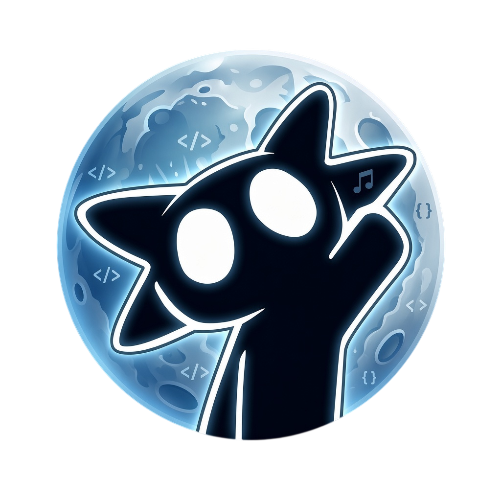

# 🌙 Velqi Luna

> **Alpha 0.1.0** — una aplicación de música en desarrollo activo, parte de la familia **Velqi**.
> Creada por **Diego Leo**. Hecha para revivir.

Velqi Luna es una versión preliminar creada para probar las funciones base de la aplicación con un grupo reducido de usuarios. Al ser una beta de prueba, no cuenta con soporte ni mantenimiento continuo, y podría presentar fallos o interrupciones en su servicio. Todos los errores reportados serán corregidos en futuras actualizaciones.



---

## ¿Qué es Velqi Luna?

Luna es la primera de una serie de versiones que irán llegando de la mano de Diego Leo — como Velqi Sol, Velqi Terra y Velqi Júpiter. Está construida sobre el **Kernel de Velqi**: un extractor propio que resuelve la obtención de streams de YouTube Music con rotación de clientes, streams muxed y manejo de cookies, para una reproducción estable.

## Características

- Reproducción de canciones de YouTube Music
- Búsqueda de canciones, artistas, álbumes y playlists
- Reproducción en segundo plano
- Descarga y caché para modo offline
- Letras sincronizadas
- Tema dinámico Material Design 3
- Soporte Android Auto
- Integración con Discord Rich Presence
- **Kernel de Velqi**: extracción robusta con rotación de clientes (Android → Android VR → iOS → TVHTML5) y streams muxed para seek y descarga sin 403

## Compilar

```bash
# Debug (recomendado para desarrollo)
./gradlew :app:assembleFossDebug

# Release
./gradlew :app:assembleFossRelease
```

Requiere JDK 17 y Android SDK (compileSdk 35). El APK debug lleva sufijo `.debug`; el release se firma por separado.

## Estado

- **Versión**: 0.1.0-Alpha (BETA)
- **Acceso**: limitado — grupo reducido de testers elegidos por Diego Leo
- **Mantenimiento**: sin compromiso continuo; errores reportados se corrigen en versiones posteriores

## Créditos

Velqi Luna es un proyecto independiente construido desde cero con la API pública de YouTube Music.

- Licencia: [GPL-3.0](LICENSE)

## Disclaimer

Este proyecto y su contenido no están afiliados, financiados, autorizados, respaldados ni asociados de ninguna forma con YouTube, Google LLC ni sus afiliados y subsidiarias.

Cualquier marca comercial, marca de servicio, nombre comercial u otros derechos de propiedad intelectual usados en este proyecto pertenecen a sus respectivos dueños.
